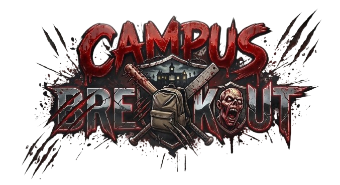

# Campus Breakout

A thrilling 2D top-down survival horror game set in a zombie-infested university campus. Built with Unity and delivered as an Android APK.



## Game Overview

**Campus Breakout** throws you into the halls of a quiet university where a normal day quickly turns into a nightmare. The once peaceful campus, full of life and learning, becomes a battleground for survival as a mysterious infection spreads rapidly through dormitories and lecture halls.

- **Genre**: 2D Top-Down Survival Horror
- **Theme**: Zombie Outbreak
- **Engine**: Unity
- **Platform**: Android (APK)
- **Pre-release Date**: April 6, 2026
- **Official Release Date**: April 16, 2026

## Features

- **Improvised Weaponry** - Baseball bats, scissors, and whatever you can find. These aren't military tools — they're school supplies used in desperation. Every swing counts.

- **Limited Visibility** - Your flashlight is your lifeline. Navigate through pitch-dark corridors where every shadow could hide a threat. Stay in the light… or lose your mind.

- **The Horde Awaits** - Zombies press against every window, lurk behind every door. The campus is surrounded — there is no easy way out. Fight, run, survive.

## The Infected

Three types of zombies await you:

- **Wander** (Green) - Slow-moving but relentless. Easy to outrun, but dangerous in groups.
- **Runner** (Yellow) - Fast and agile. Former athletes now sprinting at full speed to catch prey.
- **Tank** (Red) - Massive and nearly unstoppable. Can smash through doors and walls.

## Development Team

Meet the developers behind the nightmare:

- **Angeline De Guzman** - Game Designer & Document Specialist (Typography, Branding, Technical Direction)
- **Tristan Santos** - Game Artist (Character Design, Sprite Animation, World Building)
- **Kyla Mariano** - Game Programmer (AI, Game Logic, Audio/Video Integration)
- **Justin Vergara** - Game Programmer (Player Mechanics, Enemy Systems, Combat/Inventory)
- **Bryce Ganotice** - Instructor

## Live Website

Visit the official website: [campusbreakout.vercel.app](https://campusbreakout.vercel.app)

## Technologies Used

This project is built with:

- **Vite** - Next generation frontend tooling
- **TypeScript** - Type-safe JavaScript
- **React** - UI library
- **shadcn/ui** - UI components
- **Tailwind CSS** - Utility-first CSS framework
- **Framer Motion** - Animation library
- **Unity** - Game engine

## Development

To run the website locally:

```sh
# Install dependencies
npm i

# Start development server
npm run dev
```

## License

 2026 Campus Breakout. All rights reserved.
